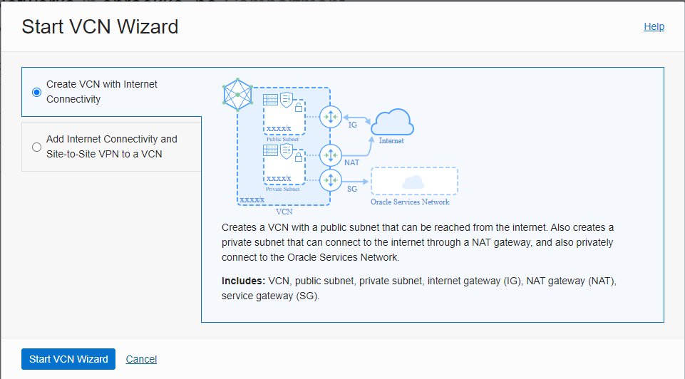

# What

Simple terraform script for creating GPU VMs in a (private) subnet and a Ngninx load balancer in a (public) subnet.  

# Prereqs

## VCN setup: 

Create VCN using the wizard created VCN, accept all defaults. 

Edited a few exceptions afterward. 

**Exception 1:** 

Added a Bastion service with entry point in the public subnet. 

In my case this one has private IP: 10.0.0.49

**Exception 2:** 

Created `Security List for Public Subnet-<your-vcn-name>`.
Attached to the public subnet, removed (de-attached) `Default Security List for <your-vcn-name>` . 
For this list I have the same egress rule as the default one, allowing the same ICMP inbound traficc.
Added rule to accept SSH traffic from Bastion ip (10.0.0.49/32) -- note, this will be different for you! 

**Exception 3:**

Edited `Security List for Private Subnet-<your-vcn-name>`.
Removed rule that allows ssh (port 22) traffic from entire network (10.0.0.0/16) 
Added rule to accept SSH traffic from Bastion ip (10.0.0.49/32) -- note, this will be different for you! 

**Exception 4:**

Remove all rules `Default Security List for <your-vcn-name>`.
This one cannot be deleted, but at least we know it wil not affact behavior of our system. 

**Note 1:** 
Net effect so far: same rule set on private and public subnet (this will of course change later) 
AND a reasonable naming standard so that we can easily make changes going forward. 

**Note 2:**
Yes, it may be better to have security lists and attach to the nics. 
But in this case I are going for simplicity. 
Feel free to expand on this as you wish.

## Variables file

Create your own variable file and include in commandline as suggested below, file name `vars_fra.tfvars`. 

Use sample file `vars.tfvars.SAMPLE` as a starting point.  

# Usage

Store config files in sub-dir config/ it is ignored by git.  

terraform plan --out=oci-core-gpu.tfplan --var-file=config/vars_fra.tfvars

terraform apply ....
